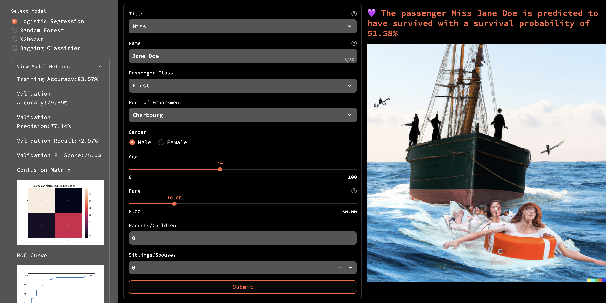

# Titanic Survival Prediction

The sinking of the RMS Titanic in 1912 is a well-known tragedy that claimed the lives of many passengers and crew members. Our objective is to build predictive models that can accurately determine whether a passenger survived or perished based on various features such as age, gender, ticket class, and more. By analyzing this dataset and applying supervised learning algorithms, we hope to gain valuable insights and unlock the secrets behind survival patterns.

Not only that, we also create a streamlit app that will use this model and give predictions for an individual's chances of survival. Check out the [demo here](https://titanic-akaiworks.streamlit.app/)

## Notebook

The modeling notebook is present in [this location](./Modeling%20Notebook/surviving-the-titanic-a-data-adventure.ipynb)

We do an extensive EDA and Feature Engineering, try different classification models and then fine-tune four models with high accuracies.

Take a look at the [model metrics](./Data/) and the [confusion matrices, roc curves](./Assets) for the four hyperparameter tuned models -
1. Logistic Regression
2. Random Forest Classifier
3. XGBoost 
4. Bagging Classifier

We use the joblib library to save the models. The saved models are stored [here](./Models)

## Predictions

Following inputs are required for prediction

- Title (Mr, Miss, Mrs, Master, Other)
- Passenger Class
- Port of Embarkment
- Gender
- Age
- Fare
- Number of Parents/Children
- Number of Siblings/Spouses

## Streamlit Application

The streamlit application accepts input details of a passenger and predicts the probability of survival. We have a cut-off at 50% for classification between 'survived' and 'did not survive'.

The prediction can be made by selecting one of the four available models. The application also displays the metrics and the confusion matrix, roc curve for the selected model.



## Run locally

__Prerequisite__: python 3.6 (or higher)

__Clone Repo__   

```
git clone https://github.com/abhinav-kimothi/Titanic-Survival.git
```

__Navigate to Dir__ 

```
cd TITANIC-SURVIVAL
```

__Enable Virtual Environment__ :
```
python3 -m venv .env
```
For Linux/MacOS
```
source .env/bin/active 
```
For Windows
```
.env\Scripts\activate
```
__Install Requirements__ :

```
pip install -r requirements.txt
```

__Run Streamlit Locally__

```
streamlit run src/main.py
```

## Get In Touch
[Visit My Website](https://abhinavkimothi.my.canva.site)

[](https://twitter.com/abhinav_kimothi) 
[](https://github.com/abhinav-kimothi)
[](https://www.linkedin.com/in/abhinav-kimothi/)
[](mailto:abhinav.kimothi.ds@gmail.com)
[](https://www.producthunt.com/@abhinav_kimothi)

